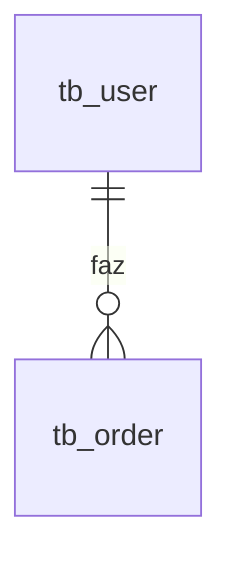
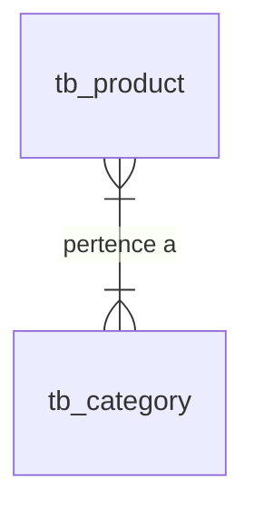

# 🧙‍♂️ Desmistificando as Anotações do Spring Boot & JPA
> **Guia de Estudos Práticos para o Curso de Java Completo**

Este guia foi criado para ajudar você a entender o que acontece por baixo dos panos (sem "mágicas") quando usamos as anotações do Spring e do JPA.

---

## 🗺️ Índice
1. [O Conceito das Etiquetas (Anotações)](#-o-conceito-das-etiquetas-anotaco-es)
2. [Mapeamento de Banco de Dados (JPA)](#-mapeamento-de-banco-de-dados-jpa)
3. [Relacionamentos entre Tabelas (Chaves Estrangeiras)](#-relacionamentos-entre-tabelas-chaves-estrangeiras)
4. [Injeção de Dependências & Controle do Spring](#-injeção-de-dependências--controle-do-spring)
5. [O Perigo dos Loops Infinitos (JSON Serialization)](#-o-perigo-dos-loops-infinitos-json-serialization)

---

## 🏷️ O Conceito das Etiquetas (Anotações)

No Java, anotações (que começam com `@`) são **metadados**. Elas não alteram a lógica do seu código diretamente; elas colam uma "etiqueta" na classe, atributo ou método. 

O framework (Spring ou Hibernate/JPA) faz um escaneamento automático nas suas pastas. Ao ler essas etiquetas, ele gera códigos adicionais por baixo dos panos.

```
+------------------+     (Spring/JPA escaneia)     +-----------------------------+
| @Entity          |  ==========================>  | Hibernate cria a tabela     |
| public class User|                               | "tb_user" no banco de dados |
+------------------+                               +-----------------------------+
```

---

## 🗄️ Mapeamento de Banco de Dados (JPA)

As anotações do pacote `jakarta.persistence.*` servem para traduzir suas classes Java para tabelas SQL.

### `@Entity`
*   **O que significa:** *"Esta classe é uma entidade de banco de dados."*
*   **Sem ela:** O Hibernate ignora a classe. Ela nunca vai virar uma tabela no H2 ou PostgreSQL.
*   **O que o JPA faz:** Executa um comando parecido com `CREATE TABLE User (...);` na inicialização do sistema.

### `@Table(name = "tb_user")`
*   **O que significa:** *"Mude o nome físico desta tabela no banco de dados para 'tb_user'."*
*   **Por que usar:** Palavras como `USER` e `ORDER` são comandos reservados do SQL. Se você tentar criar uma tabela com esses nomes exatos, alguns bancos de dados vão travar. Usar prefixos como `tb_` evita conflitos de sintaxe.

### `@Id`
*   **O que significa:** *"Este atributo é a Chave Primária (Primary Key) da tabela."*
*   **Por que é obrigatório:** O banco relacional precisa de uma coluna que identifique cada linha de forma única para realizar buscas e relacionamentos rápidos.

### `@GeneratedValue(strategy = GenerationType.IDENTITY)`
*   **O que significa:** *"O banco de dados é responsável por gerar esse ID sequencialmente (1, 2, 3...)."*
*   **Por trás dos panos:** O Hibernate adiciona um atributo de auto-incremento (como `SERIAL` ou `AUTO_INCREMENT`) na coluna do ID durante a criação da tabela. É por isso que você passa `null` ao instanciar objetos no `TestConfig`.

---

## 🔗 Relacionamentos entre Tabelas (Chaves Estrangeiras)

É aqui que a maior parte dos alunos se perde. Vamos desenhar os relacionamentos do seu projeto para entender como eles funcionam fisicamente.

### 1. Um-para-Muitos (`@OneToMany`) e Muitos-para-Um (`@ManyToOne`)

No seu projeto, **um Usuário (`User`) pode ter muitos Pedidos (`Order`)**, mas **um Pedido pertence a apenas um Usuário**.



#### No lado do Pedido (`Order.java`):
```java
@ManyToOne
@JoinColumn(name = "client_id")
private User client;
```
*   **`@ManyToOne`:** Avisa ao JPA que muitos registros desta tabela (`tb_order`) apontam para o mesmo registro de `tb_user`.
*   **`@JoinColumn(name = "client_id")`:** Cria fisicamente uma coluna chamada `client_id` na tabela `tb_order`. Essa coluna guardará o número do ID do cliente.

#### No lado do Usuário (`User.java`):
```java
@OneToMany(mappedBy = "client")
private List<Order> orders = new ArrayList<>();
```
*   **`@OneToMany`:** Permite que o Java liste os pedidos de um usuário usando `usuario.getOrders()`.
*   **`mappedBy = "client"`:** **Essencial!** Diz ao JPA que o relacionamento já foi mapeado pelo atributo `client` na classe `Order`. Sem isso, o JPA tentaria criar uma tabela intermediária desnecessária.

---

### 2. Muitos-para-Muitos (`@ManyToMany`)

Um **Produto (`Product`)** pode pertencer a várias **Categorias (`Category`)**, e uma Categoria pode ter vários Produtos.



No banco de dados relacional, não é possível conectar duas tabelas diretamente de forma N:N. Precisamos de uma **tabela intermediária** (tabela de associação).

#### No lado do Produto (`Product.java`):
```java
@ManyToMany
@JoinTable(
    name = "tb_product_category", 
    joinColumns = @JoinColumn(name = "product_id"), 
    inverseJoinColumns = @JoinColumn(name = "category_id")
)
private Set<Category> categories = new HashSet<>();
```
*   **`@ManyToMany`:** Declara a relação de muitos-para-muitos.
*   **`@JoinTable(...)`:** Cria fisicamente a tabela intermediária no banco:
    *   `name = "tb_product_category"`: Nome da nova tabela.
    *   `joinColumns`: Cria a coluna `product_id` que aponta para o Produto dono da relação.
    *   `inverseJoinColumns`: Cria a coluna `category_id` que aponta para a Categoria associada.

---

### 3. Chave Composta (`@EmbeddedId` & `@Embeddable`)

Você criou a entidade `OrderItem` (Item do Pedido). Ela serve para ligar um `Order` a um `Product`, salvando informações extras como `quantity` e `price`.

A chave primária dessa tabela é composta: ela é o par `(order_id, product_id)`.

#### Na classe auxiliar (`OrderItemPK.java`):
```java
@Embeddable
public class OrderItemPK implements Serializable {
    @ManyToOne
    @JoinColumn(name = "order_id")
    private Order order;

    @ManyToOne
    @JoinColumn(name = "product_id")
    private Product product;
}
```
*   **`@Embeddable`:** Avisa ao JPA: *"Esta classe não é uma tabela. Ela é apenas um grupo de atributos que será embutido dentro de outra entidade."*

#### Na classe principal (`OrderItem.java`):
```java
@EmbeddedId
private OrderItemPK id;
```
*   **`@EmbeddedId`:** Diz ao JPA: *"A chave primária desta tabela é o conjunto de campos que está dentro da classe auxiliar `id`."*

---

## ⚡ Injeção de Dependências & Controle do Spring

As anotações do pacote `org.springframework.*` controlam quem cria e conecta as classes do seu projeto.

### `@Service`
*   **O que significa:** *"Spring, crie um único objeto desta classe na memória e gerencie ele para mim."*
*   **O que acontece por trás:** Quando o projeto liga, o Spring cria um contêiner chamado **ApplicationContext**. Ele executa algo como `UserService userService = new UserService();` e guarda lá dentro.

### `@Autowired`
*   **O que significa:** *"Spring, procure na sua memória o objeto que eu preciso e coloque ele nesta variável."*
*   **Sem ela:** Sua variável fica `null`, gerando o clássico erro `NullPointerException` ao rodar o projeto.

```
       +---------------------------------------------+
       |           Memória do Spring (Context)       |
       |  [ UserRepository ]     [ UserService ]     |
       +---------------------------------------------+
                                       || (Injeta via @Autowired)
                                       \/
                           +------------------------+
                           |     UserResource       |
                           +------------------------+
```

---

## 🛑 O Perigo dos Loops Infinitos (JSON Serialization)

Quando um cliente acessa o seu controlador web (`UserResource`), o Spring precisa transformar seus objetos Java em texto JSON para enviar pela rede. 

Esse processo é chamado de **Serialização** (feito por uma biblioteca interna chamada Jackson).

### O problema do relacionamento bidirecional:
1. O Jackson começa a ler o objeto `User`. Ele vê o campo `name: "Maria"`.
2. Ele vê a lista `orders`. Ele abre o primeiro `Order`.
3. Dentro do `Order`, ele vê o campo `client` (que aponta de volta para o `User`).
4. Ele tenta ler o `User` novamente... que o leva a ler a lista de `orders`... que o leva a ler o `User` de novo.
5. Isso se repete até estourar a pilha de memória do seu computador (`StackOverflowError`).

```
User ──> List<Order> ──> Order ──> User (Dono) ──> List<Order> ──> (Loop Infinito) 🔄
```

### A Solução: `@JsonIgnore`
*   **O que faz:** *"Jackson, quando você estiver transformando este objeto em texto JSON, IGNORE este campo específico."*
*   **Onde usar:** Sempre no lado **Muitos** da relação bidirecional (ex: no atributo `client` da classe `Order`). Assim, quando ele ler o pedido, ele não tentará puxar as informações do cliente de forma recursiva, quebrando o ciclo.

---

## 📋 Tabela Resumo das Anotações

| Anotação | Onde ela vive | O que ela grita para o framework |
| :--- | :--- | :--- |
| **`@Entity`** | Acima da classe | *"Eu sou uma tabela de banco de dados!"* |
| **`@Table`** | Acima da classe | *"Mude o nome da minha tabela física para..."* |
| **`@Id`** | Em cima de um atributo | *"Eu sou a chave primária única desta linha!"* |
| **`@GeneratedValue`**| Em cima de um atributo | *"Banco, calcule o valor desse ID para mim!"* |
| **`@ManyToOne`** | Em cima de um atributo | *"Eu sou uma chave estrangeira simples apontando para outra tabela."* |
| **`@OneToMany`** | Em cima de uma lista | *"Eu sou a lista reversa de um relacionamento que já foi mapeado."* |
| **`@ManyToMany`** | Em cima de uma coleção | *"Nós precisamos de uma tabela intermediária para nos conectar."* |
| **`@JoinTable`** | Em cima de uma coleção | *"As configurações da nossa tabela intermediária são estas..."* |
| **`@EmbeddedId`** | Em cima de um atributo | *"Minha chave primária é composta e está dentro da classe X."* |
| **`@Embeddable`** | Acima de uma classe PK | *"Eu sou apenas uma classe auxiliar para agrupar campos."* |
| **`@JsonIgnore`** | Em cima de atributos | *"Não transforme este campo em JSON para evitar loops!"* |
| **`@Service`** | Acima da classe | *"Spring, guarde um objeto meu na memória do sistema!"* |
| **`@Autowired`** | Em cima de atributos | *"Spring, preencha esta variável com o objeto que está na sua memória!"* |
| **`@RestController`**| Acima da classe | *"Eu recebo conexões HTTP e respondo com dados puros (JSON)."* |
| **`@RequestMapping`**| Acima da classe | *"Eu atendo as requisições que chegam no endereço X."* |
| **`@GetMapping`** | Acima de um método | *"Eu trato requisições do tipo GET (busca de dados)."* |
| **`@PathVariable`** | Parâmetro do método | *"Pega o valor da URL da internet e injeta nesta variável."* |
